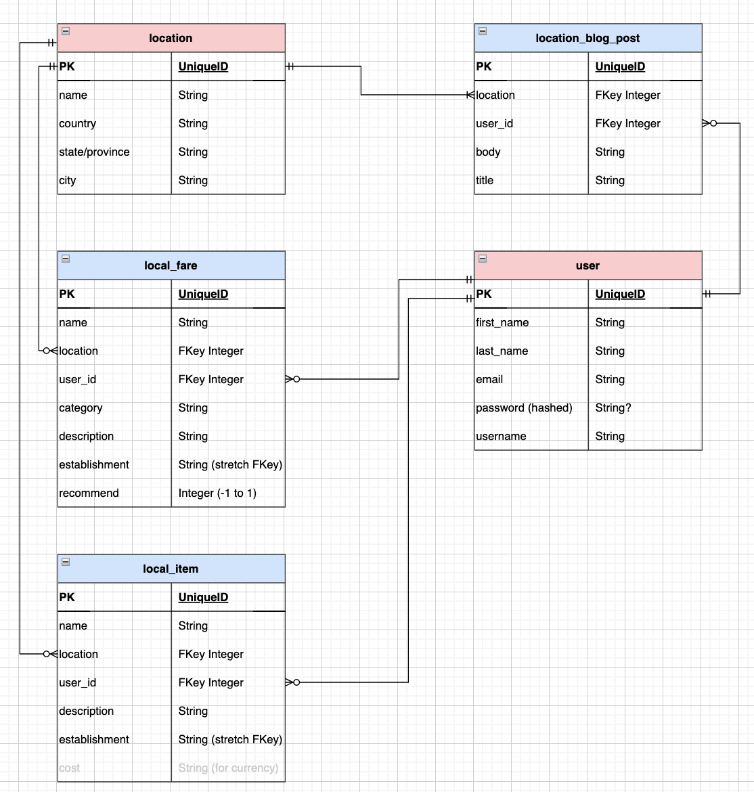

# Shop - Travel - Work

## A Digital Nomad Community

---

## Date: 9/1/2022 - 9/14/2022

---

### Created by Patrick Knight

[Patrick Knight](https://www.linkedin.com/in/patrick-f-knight/)

---

### **_Project Links_**

[Trello](https://trello.com/b/OW6x9FLC/ga-capstone) | [Deployment](https://ancient-eyrie-35166.herokuapp.com/)

### **_Frontend Repository_**

[STW Client](https://github.com/pfknight8/shop_travel_work-client)

---

### Description

#### This is my capstone project for General Assembly - SEI program. This website aims to serve as a place for Digital Nomads to gather (whether practicing or aspiring). Remote work has had a great amount of growth these days, and one of the potential benefits of being offsite is that one can technically work from anywhere. This has led to the concept of the 'digital nomad,' where one no longer has to wait for a suitable vacation window to go and see the world, but can go anywhere with reliable internet and still be able to work.
#### The objective of this site is for people to encourage each other to take the opportunity to go and experience the world while they have the opportunity. Post places that you've been, what local fare to expect, and what types of local crafts are available to browse.
#### The initial build will be limited to myself and my wife, but expansion to a community website is the ultimate stretch goal. Please feel free to check back every once in a while to see my progress.

---

### Technologies

* Django/Python3
* PostgreSQL

---

### Screenshots

#### **_ERD_**

---

### Getting Started

- `Fork` & `Clone` this repository
- `pipenv install` necessary dependencies
- `pipenv shell` in the project root to start a virtual environment

#### Dependencies (packages) include: psycopg2-binary, django-cors-headers, rest_framework, dj-database-url, rest_framework_simplejwt, django-filter, python-decouple, WhiteNoiseMiddleware, and gunicorn

---

### Future Updates

- [x] ~~User model with authentication~~
- [ ] Model improvements, such as user profile pictures
- [ ] Expansion into other content, such as article hosting, user interactions, etc

---

### Credits

#### Created as a part of the General Assembly - SEI program.

#### As an exercise in teaching myself Django, this project would not have been possible without the various resources available. I owe my gratitude to the people who have taken the time to assemble and maintain these resources, as well as answer the questions posted on these sites.

* Django REST Framework [Docs](https://www.django-rest-framework.org/)
* Django Project [Docs](https://www.djangoproject.com/)
* Django Book [Docs](https://django-book.readthedocs.io/en/latest/index.html)
* [Python Package Index](https://pypi.org/)
* Articles by Vitor Freitas: [simple is better than complex](https://simpleisbetterthancomplex.com/)
* Various GitHub projects:
  * [django-abstractbaseuser](https://github.com/geekinsta/django-abstractbaseuser/blob/main/accounts/models.py)
  * [Django-User-Model-Unleashed](https://github.com/codingforentrepreneurs/Django-User-Model-Unleashed/blob/master/src/accounts/models.py)
* Coding for Entrepreneurs ([cfe](https://www.codingforentrepreneurs.com/blog/how-to-create-a-custom-django-user-model/)
* And SO many [stackoverflow](https://stackoverflow.com/) posts

#### I'll also include my wife, Tara, for inspiration on choosing this project topic.