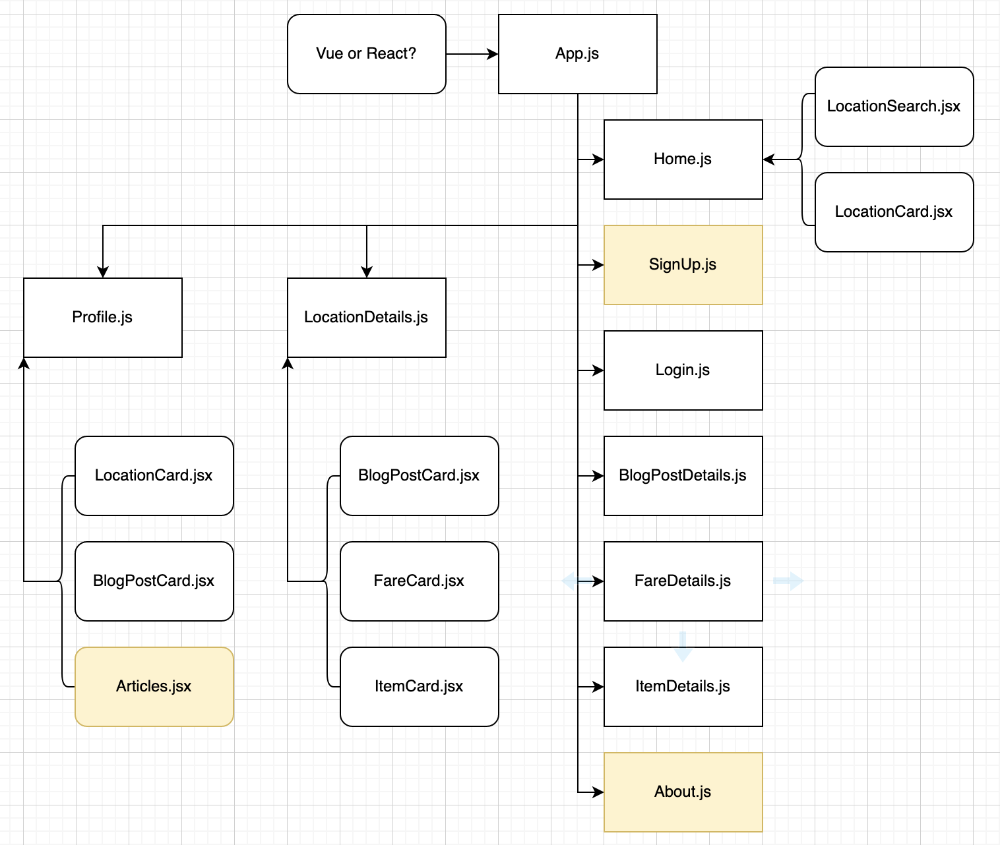
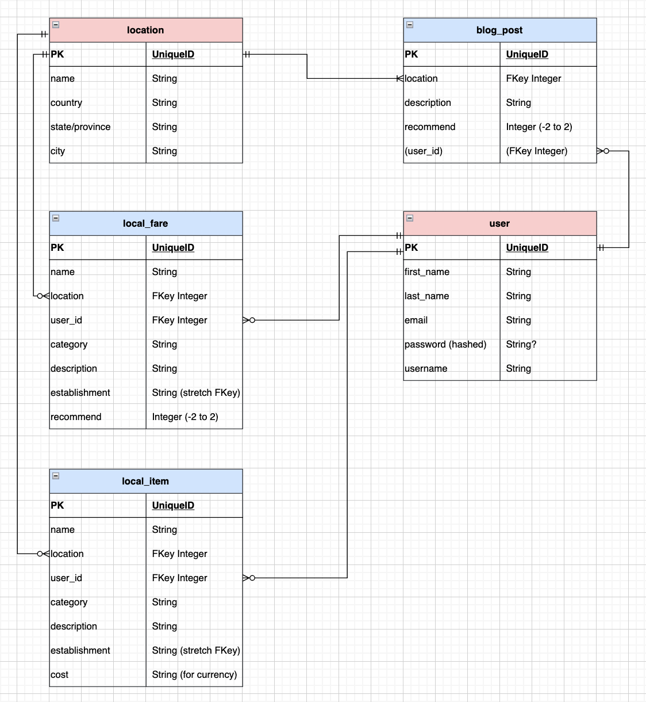

# Shop - Travel - Work

## A Digital Nomad Community

---

## Date: 9/1/2022 - 9/14/2022

---

### Created by Patrick Knight

[Patrick Knight](https://www.linkedin.com/in/patrick-f-knight/)

---

### **_Project Links_**

[Trello](https://trello.com/b/OW6x9FLC/ga-capstone) | [Deployment]

---

### Description

#### This is my capstone project for General Assembly - SEI program. This website aims to serve as a place for Digital Nomads to gather (whether practicing or aspiring). Remote work has had a great amount of growth these days, and one of the potential benefits of being offsite is that one can technically work from anywhere. This has led to the concept of the 'digital nomad,' where one no longer has to wait for a suitable vacation window to go and see the world...one can go anywhere with reliable internet and still be able to work.
#### The objective of this site is for people to encourage each other to take the opportunity to go and experience the world while they have the opportunity. Post places that you've been, what local fare to expect, and what types of local crafts are available...
#### The initial build will be limited to myself and my wife, but expansion to a community website is a stretch goal.
#### **_More to come..._**

---

### Technologies

* Django/Python3
* PostgreSQL
* ???

---

### Screenshots

#### **_Component Hierarchy_**

#### **_ERD_**

---

### Getting Started

- `Fork` & `Clone` this repository.
- `npm i` to install necessary dependencies.

#### Dependencies...

---

### Future Updates

[ ] One
[x] ~~Two~~

---

### Credits

#### Created as a part of the General Assembly - SEI program.

* My wife, Tara, for inspiration